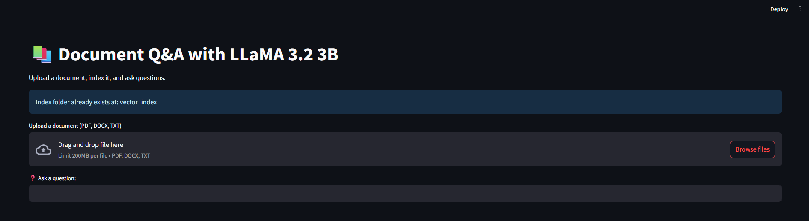
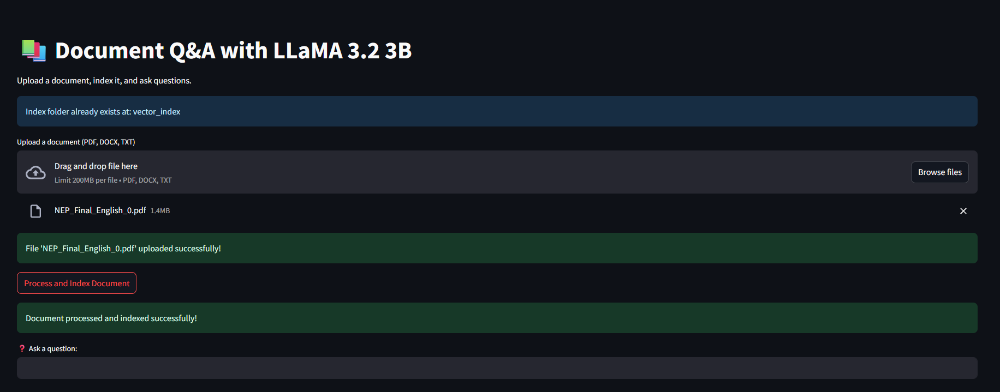
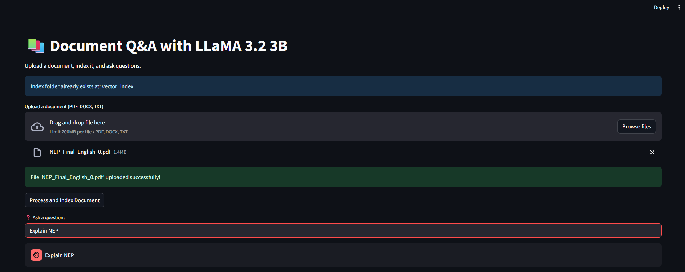
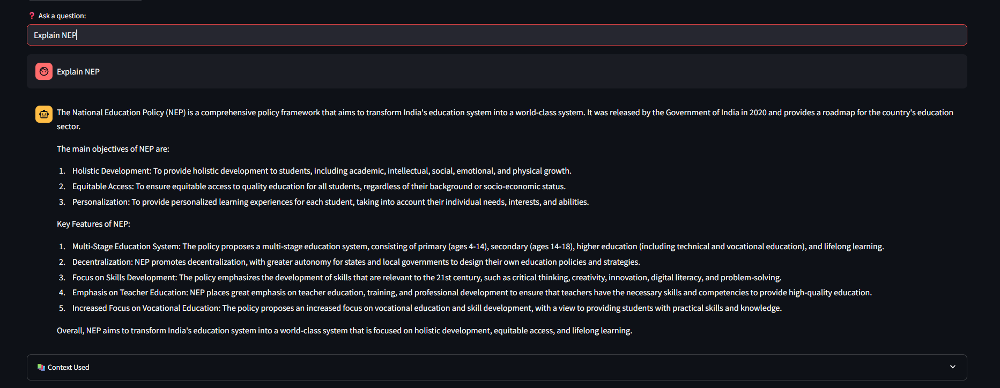

# Document Analyzer App (Using Streamlit)

**Models Used**:sentence transformers and Llama 3.2-3B served via Ollama.  

This project is a Streamlit web application that allows you to chat with your documents. You can upload a PDF, DOCX, or TXT file, and the application will index its content, allowing you to ask questions and receive answers based on the document's information.

The question-answering is powered by a locally running **Llama 3.2-3B** model, served via the Ollama server API. The embedding model used is **`sentence-transformers/all-MiniLM-L6-v2`**.

## How It Works

The application follows a RAG (Retrieval-Augmented Generation) architecture:

1.  **Document Upload & Processing**: The user uploads a document through the Streamlit interface. The text is extracted and split into smaller, overlapping chunks.
2.  **Embedding & Indexing**: Each text chunk is converted into a numerical vector (embedding) using the `sentence-transformers/all-MiniLM-L6-v2` model. These vectors are then stored in a high-speed FAISS vector index on the local disk.
3.  **User Query**: The user asks a question in the chat interface.
4.  **Similarity Search**: The user's question is also converted into an embedding. The FAISS index is then searched to find the text chunks from the document that are most semantically similar to the question.
5.  **LLM Answering**: These relevant text chunks (the "context") and the original question are sent in a formatted prompt to the Ollama API endpoint.
6.  **Display Answer**: The LLaMA 3.2 model generates an answer based on the provided context, which is then displayed to the user.

---

## Prerequisites

Before you begin, you must have the **Ollama Server** installed and running with the correct model.

#### Setting up Ollama and Llama 3.2-3B (Step-by-Step)

1.  **Download and Install Ollama**:
    * Go to the official Ollama website: <https://ollama.com>
    * Download and run the installer for your operating system (Windows, macOS, or Linux).

2.  **Pull the Llama 3.2 Model**:
    * Once Ollama is installed, open your terminal (Command Prompt, PowerShell, or Terminal on Mac/Linux).
    * Run the following command to download and set up the `llama3.2:3b` model:
        ```bash
        ollama run llama3.2:3b
        ```
    * This command will download the model and start the Ollama server. You can type `/bye` to exit the prompt once it's ready.

3.  **Ensure the Ollama Server is Running**:
    * The Ollama application must be running in the background. On Windows and macOS, it usually runs automatically and has an icon in your system tray or menu bar.
    * You can verify the model is available by running `ollama list` in your terminal. You should see `llama3.2:3b` in the output.

---

## Installation & Setup

Follow these steps to set up the Python environment and run the application.

1.  **Clone or Download the Code**:
    * Download all the project files (`interface.py`, `indexing.py`, `llm_query.py`, `requirements.txt`) into a single folder on your computer.

2.  **Create a Python Virtual Environment**:
    * Open a terminal in your project folder and run the following commands:
        ```bash
        # Create a virtual environment
        python -m venv venv
        
        # Activate the virtual environment
        # On Windows:
        .\venv\Scripts\activate
        # On macOS/Linux:
        source venv/bin/activate
        ```

3.  **Install Dependencies**:
    * With your virtual environment active, install all the required Python libraries:
        ```bash
        pip install -r requirements.txt
        ```

---

## Running the Application

1.  Make sure your Ollama server is running.
2.  Ensure your virtual environment is active (`(venv)` should be in your terminal prompt).
3.  Run the following command in your terminal:
    ```bash
    streamlit run interface.py
    ```
4.  The application will open in a new tab in your web browser.

---

## How to Use the App

1.  Use the "Upload a document" button to select a PDF, DOCX, or TXT file.
    
2.  Once uploaded, click the "Process and Index Document" button and wait for the success message.
    
3.  Type your question into the text input box at the bottom and press Enter.
    
4.  The answer generated by LLaMA will appear in the chat.
    
5.  You can view the exact context chunks used for the answer by expanding the "Context Used" section.
    
---

## File Structure

* `interface.py`: The main file that runs the Streamlit web interface and handles user interaction.
* `indexing.py`: Contains functions for document processing (text extraction, chunking, embedding, FAISS indexing).
* `llm_query.py`: Contains functions for querying the index and making API requests to the Ollama server.
* `requirements.txt`: A list of all required Python packages.

# Document Analyzer App (using Tkinter)

This Document Analyzer is a tool that utilizes a local Large Language Model (LLM) to answer questions about your documents. It works by processing and indexing your documents, and then using the Ollama service to generate answers based on the document's content.

## Setup and Installation

### Prerequisites: Installing Ollama

The Document Analyzer requires the Ollama service to be running to provide generative AI capabilities. Ollama must be installed and running on the machine that will act as the LLM server.

**Step 1: Download Ollama**
* Navigate to the official Ollama website: [ollama.com](https://ollama.com)
* Click the "Download" button, and then select "Download for Windows". This will download the `OllamaSetup.exe` installer.

**Step 2: Install Ollama**
* Locate and run the downloaded `OllamaSetup.exe` file.
* Follow the on-screen instructions to complete the installation. Ollama will run as a background service, and you should see its icon in your Windows system tray.

**Step 3: Pull Llama 3.2-3B Model**
* After installation, you must download a model for Ollama to serve. Open a Command Prompt or PowerShell terminal.
* Run the `ollama run` command with the model name.
    ```bash
    ollama run llama3.2:3b-instruct
    ```
* To verify the download, run `ollama list`. You should see the model you just pulled in the list.

**Step 4 (For Network Access Only): Configure Host**
* If the Document Analyzer UI will be on a different machine than the Ollama server, you must configure Ollama to accept network requests.
* On the server machine, open a Command Prompt and set the host environment variable *before* starting the Ollama service:
    ```bash
    set OLLAMA_HOST=0.0.0.0
    ```
* Then, start the Ollama service from that same terminal.

---

### For End-Users (Using the Batch File)

This is the simplest way to run the application without manual setup.

1.  **Ensure Ollama is Running**: Before starting, verify that the Ollama application is running on the designated server machine as described in the prerequisite section.
2.  **Unzip the Project Folder**: Unzip the entire project folder to a location on your computer.
3.  **Run the Batch File**: Double-click the `run_interface2.bat` file. This will automatically:
    * Create a Python virtual environment if one doesn't exist.
    * Install all the required packages from `requirements.txt`.
    * Launch the `interface2.py` application.

---

### For Developers (Manual Setup)

1.  **Clone the Repository**:
    Get the project files (`gui.py`, `core_utils.py`, `indexing2.py`, `llm_query2.py`).

2.  **Create Virtual Environment**:
    ```bash
    python -m venv venv
    ```

3.  **Activate Environment**:
    ```bash
    .\venv\Scripts\activate
    ```

4.  **Install Dependencies**:
    ```bash
    pip install -r requirements.txt
    ```

5.  **Run Application**:
    ```bash
    python interface2.py
    ```

---

## User Guide

### Step 1: Run the Application

Launch the application by either running the `run_interface2.bat` file or executing `python interface2.py` from your terminal.

### Step 2: Upload a Document

Click the "Browse Files" button to open a file dialog. Select a supported document (`.pdf`, `.docx`, or `.txt`)
